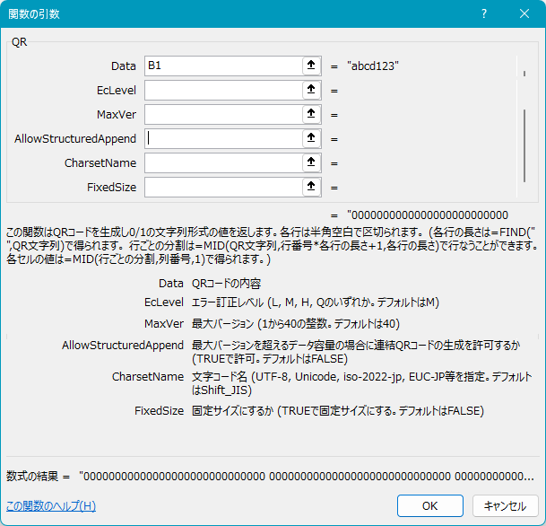

# QRCodeLibVBA
QRCodeLibVBAは、Excel VBAで書かれたQRコード生成ライブラリです。  
JIS X 0510:2004に基づくモデル2コードシンボルを生成します。

## オリジナルとの差異
[オリジナル](https://github.com/yas78/QRCodeLibVBA)から画像ファイルやIPictureDispオブジェクトの作成機能を削除しています。
その代わりとして文字列化されたQRコードを取得し，ワークシート関数と条件付き書式により画像として利用する方法を取っています。

## 特徴
- 数字・英数字・8ビットバイト・漢字モードに対応しています
- 分割QRコードを作成可能です
- 文字セットを指定可能です
- ワークシート関数として利用可能です

## 要件
- 文字列を指定した文字コードのバイト列として取得するために `ADODB.Stream` を参照します。

## クイックスタート

- `bin/Release.xlsm` をダウンロードして開いてください。
- `使用例` シートの `B1` セルへQRコード化したい文字列を入力してください。
- `D5` セル以降の範囲がQRコードとなるので範囲を選択してコピーし，使用箇所にて「リンクされた図」として貼りつけを行います。

## 使用方法

- ワークシート関数 `QR` を使用し，指定した条件（エラー訂正レベル、QRコードの最大バージョン、構造化付加モード、文字セット、固定サイズ設定）に基づくQRコードを文字列形式で取得します。（使用例シートのB2セル）
    - `Data` : QRコードの内容
    - `EcLevel` : エラー訂正レベル（ `"L", "M", "Q", "H"`のいずれか。指定しない場合は`"M"`）
    - `MaxVer` : 最大バージョン（`1`から`40`の整数。指定しない場合は`40`）
    - `AllowStructuredAppend` : 最大バージョンを超えるデータ容量の場合に連結QRコードの生成を許可するか（`TRUE`で許可。指定しない場合は`FALSE`）
    - `CharsetName` : 文字コード名（`"UTF-8", "Unicode", "iso-2022-jp", "EUC-JP"`等を指定する。指定しない場合は`"Shift_JIS"`となり，日本語の場合 `Kanji`モードを用いて符号化する。
    - `FixedSize` : 固定サイズにするか（`TRUE`で固定サイズにする。指定しない場合は`FALSE`）

```
[QR-String]
=QR([Data],[EcLevel],[MaxVer],[AllowStructuredAppend],[CharsetName],[FixedSize])
```

- 文字列形式のQRコードのデータは，明モジュールは0，暗モジュールは1，行区切りは半角空白なので，まずはこれを行ごとのデータに分割するため，以下の数式を用いて１行あたりのモジュール数を得ます。（使用例シートのB3セル）

```
[ModSizePerRow]
=FIND(" ",[QR-String])
```

- 以下の数式を用いて行ごとのデータに分割します。（使用例シートのB5～B146セル）
    - `RowIndex` : 1から始まる行番号

```
[QR-String-Row]
=MID([QR-String], ([RowIndex]-1)*[ModSizePerRow]+1, [ModSizePerRow])
```

- 以下の数式を用いて各セルに対応する単一モジュールの明暗データを得ます。（使用例シートのD5～EW146セル）
    - `ColumnIndex` : 1から始まる列番号

```
=MID([QR-String-Row],[ColumnIndex],1)
```

- 条件付き書式（特定の文字列’1’を含む場合に黒色塗りつぶし）を設定し，QRコード画像を得ます。注意点として，MID関数で文字列として1を取り出しているので，数値としての1ではなく文字列の1を指定します。（使用例シートのD5～EW146セル）


- QRコードのセル範囲を選択し，コピーし，任意の場所で「リンクされた図」として貼りつけを行います。


## 詳細

コードの詳細は `bin/Debug.xlsm` を確認してください。

以下の内容が記録されています。

- 各クラス，各プロシージャの説明ドキュメント


- 処理のフローチャート


- 実行時のプロシージャの呼出履歴の例


なお，実行時のプロシージャの呼出履歴の作成には[StackTraceLib_VBA](https://github.com/ahox/StackTraceLib_VBA)を使用しています。


